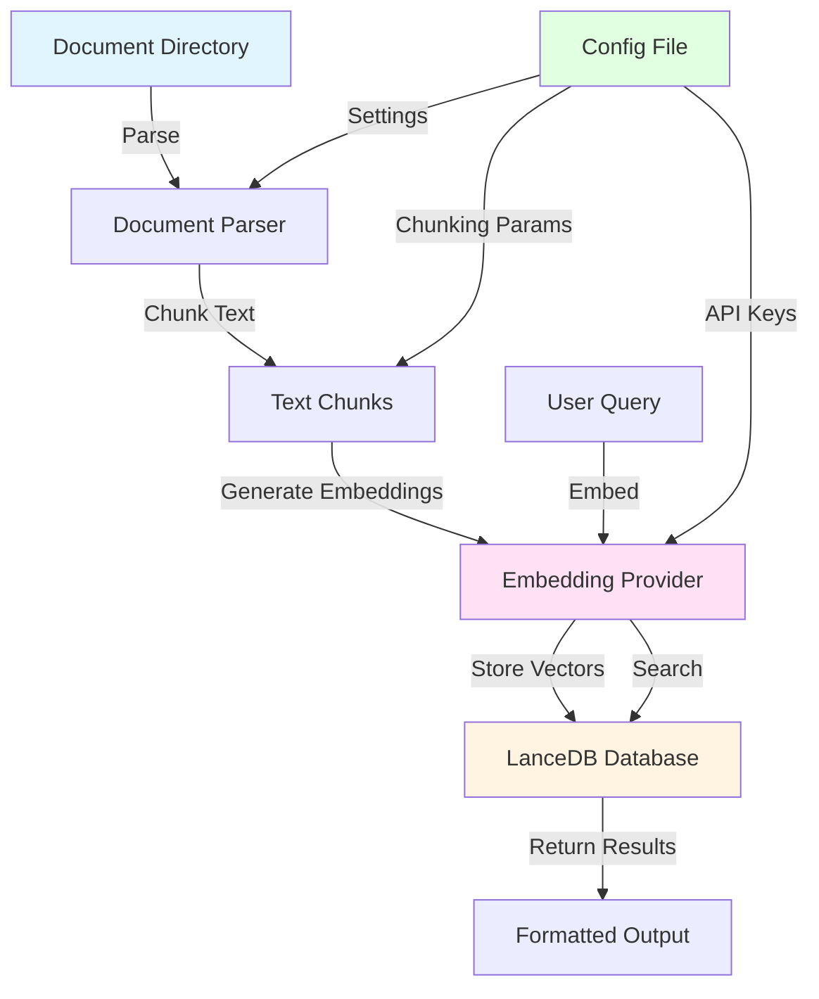
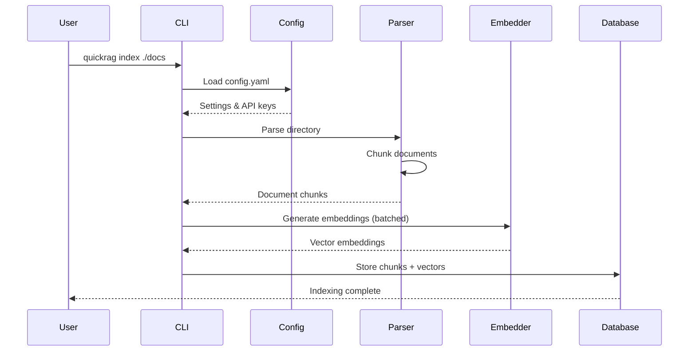
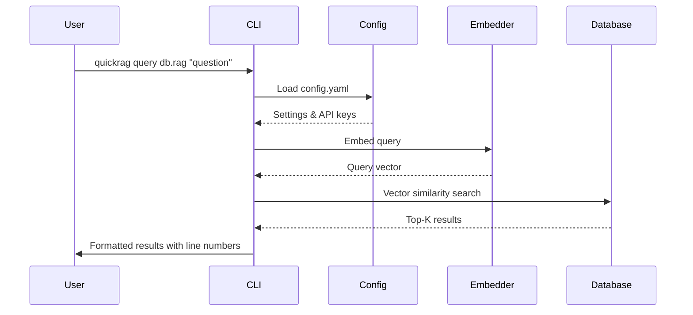

# QuickRAG

[](https://github.com/statico/quickrag/actions/workflows/build.yml)
[](https://github.com/statico/quickrag/releases)
[](http://unlicense.org/)

A fast and flexible RAG (Retrieval-Augmented Generation) tool that indexes parseable documents (text, markdown) using your choice of embedding provider and stores them in a LanceDB database for efficient similarity search.

## Quick Example

```sh
# Create a config
$ quickrag init

# Index my corpus of text files
$ quickrag index gutenberg/ --output gutenberg.rag
Parsing documents from gutenberg...
Found 171800 chunks from gutenberg
Indexing 171800 chunks...
Embedding batch 1/1718...
Embedding batch 2/1718...
Embedding batch 3/1718...
...

# Search the corpus
$ quickrag query gutenberg.rag "Who is Sherlock Holmes?"
Found 5 results:
...
[5] gutenberg/sherlock-holmes.txt (lines 2156-2181)
============================================================
it closing in upon me. My life is spent in one long effort to escape
from the commonplaces of existence. These little problems help me to do
so.”

“And you are a benefactor of the race,” said I.

He shrugged his shoulders. “Well, perhaps, after all, it is of some
little use,” he remarked. “‘_L’homme c’est rien—l’œuvre c’est tout_,’
as Gustave Flaubert wrote to George Sand.”
```

## Quick Notes

**Note for AI Tools**: This tool is designed primarily for use by other AI tools and agents for searching data in a corpus. The tool provides extensive `--help` documentation that AI tools can read to understand its full functionality and available options. Run `quickrag --help`, `quickrag index --help`, or `quickrag query --help` to explore all available commands and parameters.

> [!WARNING]
> This project was completely vibe-coded with [Claude Code](https://claude.com/claude-code) and [Cursor](https://www.cursor.com/).

## Features

- **Multiple Embedding Providers** - Support for VoyageAI, OpenAI, and Ollama
- **Flexible Document Parsing** - Automatically processes text and markdown files from directories
- **LanceDB Integration** - Fast vector search using LanceDB with persistent storage (`.rag` files)
- **Configurable Chunking** - Tunable chunk size and overlap for optimal retrieval
- **Idempotent Indexing** - Automatically tracks indexed files and skips unchanged files
- **Per-File Transactions** - All chunks for a file are indexed atomically (all or nothing)
- **UTF-8 Sanitization** - Handles invalid characters from PDF conversions and other sources
- **Configuration Management** - Centralized config file for API keys and settings
- **TypeScript & Bun** - Built with modern TypeScript and powered by Bun for fast execution
- **Easy to Use** - Simple CLI interface for indexing and querying your documents

## Architecture

### System Overview



### Indexing Flow



### Query Flow



## Chunking Algorithm

QuickRAG uses a sophisticated chunking algorithm designed to preserve semantic boundaries while maintaining configurable granularity.

### Algorithm Details

The chunking process follows these steps:

1. **Text Splitting**: Documents are split into chunks of a specified size (default: 1000 characters)
2. **Sentence Boundary Detection**: Within the last 100 characters of each chunk, the algorithm searches for sentence endings (`.!?` followed by whitespace)
3. **Boundary Adjustment**: If a sentence boundary is found, the chunk is truncated at that point to avoid splitting sentences
4. **Overlap Calculation**: The next chunk starts with an overlap (default: 200 characters) to preserve context across boundaries
5. **Line Number Tracking**: Each chunk tracks its start and end line numbers (1-indexed) for precise source location

### Chunking Example

```
Original Text (lines 1-10):
┌─────────────────────────────────────┐
│ Line 1: The quick brown fox jumps. │
│ Line 2: Over the lazy dog.         │
│ Line 3: The dog was sleeping.      │
│ Line 4: Under a tree.               │
│ Line 5: It was a sunny day.         │
│ ...                                 │
└─────────────────────────────────────┘

With chunkSize=100, chunkOverlap=20:

Chunk 1 (lines 1-3):
┌─────────────────────────────────────┐
│ Line 1: The quick brown fox jumps. │
│ Line 2: Over the lazy dog.         │
│ Line 3: The dog was sleeping.      │
│ [ends at sentence boundary]        │
└─────────────────────────────────────┘

Chunk 2 (lines 3-5):
┌─────────────────────────────────────┐
│ ...dog was sleeping. [overlap]      │
│ Line 4: Under a tree.               │
│ Line 5: It was a sunny day.         │
└─────────────────────────────────────┘
```

### Chunking Parameters

The chunking algorithm can be tuned via configuration:

- **`chunkSize`** (default: 1000): Maximum characters per chunk. Larger chunks provide more context but may reduce precision. Smaller chunks improve granularity but may lose context.
- **`chunkOverlap`** (default: 200): Characters of overlap between consecutive chunks. Overlap ensures important context at boundaries isn't lost. Too little overlap may fragment related content; too much increases storage and processing costs.

### Tuning Recommendations

**For Technical Documentation:**
- `chunkSize: 1500-2000` - Technical docs often have longer, self-contained sections
- `chunkOverlap: 300-400` - Preserve code examples and explanations that span boundaries

**For Narrative Text (Novels, Articles):**
- `chunkSize: 800-1200` - Narrative text benefits from smaller, focused chunks
- `chunkOverlap: 150-250` - Moderate overlap preserves story flow

**For Code Documentation:**
- `chunkSize: 1000-1500` - Balance between code blocks and explanations
- `chunkOverlap: 200-300` - Ensure code examples aren't split awkwardly

**For Dense Academic Papers:**
- `chunkSize: 2000-3000` - Academic papers have longer, interconnected sections
- `chunkOverlap: 400-600` - Higher overlap to preserve argument flow

## Installation

### Download Binary

Install the latest release:

```sh
# macOS (Apple Silicon)
curl -L https://github.com/statico/quickrag/releases/latest/download/quickrag-darwin-arm64 -o /usr/local/bin/quickrag
chmod +x /usr/local/bin/quickrag

# macOS (Intel)
curl -L https://github.com/statico/quickrag/releases/latest/download/quickrag-darwin-x64 -o /usr/local/bin/quickrag
chmod +x /usr/local/bin/quickrag

# Linux (ARM64)
curl -L https://github.com/statico/quickrag/releases/latest/download/quickrag-linux-arm64 -o /usr/local/bin/quickrag
chmod +x /usr/local/bin/quickrag

# Linux (x64)
curl -L https://github.com/statico/quickrag/releases/latest/download/quickrag-linux-x64 -o /usr/local/bin/quickrag
chmod +x /usr/local/bin/quickrag
```

Note: macOS binaries are not codesigned. You may need to right-click and select "Open" or run `xattr -d com.apple.quarantine /usr/local/bin/quickrag` to bypass Gatekeeper.

### Build from Source

Requires [Bun](https://bun.sh).

```sh
git clone https://github.com/statico/quickrag.git
cd quickrag
bun install
bun run dev --help
```

## Quick Start

### 1. Initialize Configuration

```sh
quickrag init
```

This creates a default configuration file at `~/.config/quickrag/config.yaml`:

```yaml
provider: ollama
model: nomic-embed-text
baseUrl: http://localhost:11434
chunking:
  chunkSize: 1000
  chunkOverlap: 200
```

### 2. Configure Your Settings

Edit `~/.config/quickrag/config.yaml` to set your API keys and preferences:

```yaml
provider: openai
apiKey: sk-your-key-here
model: text-embedding-3-small
chunking:
  chunkSize: 1500
  chunkOverlap: 300
```

### 3. Index Documents

```sh
quickrag index ./documents --output my-docs.rag
```

### 4. Query the Index

```sh
quickrag query my-docs.rag "What is the main topic?"
```

## Usage

### Configuration File

QuickRAG uses a configuration file at `~/.config/quickrag/config.yaml` to store default settings. You can override any setting via CLI options.

**Configuration Options:**

- `provider`: Embedding provider (`openai`, `voyageai`, or `ollama`)
- `apiKey`: API key for the provider (can also use environment variables)
- `model`: Model name for the embedding provider
- `baseUrl`: Base URL for Ollama (default: `http://localhost:11434`)
- `chunking.chunkSize`: Chunk size in characters (default: 1000)
- `chunking.chunkOverlap`: Overlap between chunks in characters (default: 200)

### Indexing Documents

Index a directory of documents:

```sh
quickrag index ./documents --output my-docs.rag
```

**Idempotent Indexing**: QuickRAG automatically tracks which files have been indexed and skips files that are already up to date. If a file's modification time changes, it will be re-indexed. This makes re-running the index command safe and efficient.

Override chunking parameters:

```sh
quickrag index ./documents --chunk-size 1500 --chunk-overlap 300 --output my-docs.rag
```

Use a different provider:

```sh
quickrag index ./documents --provider openai --model text-embedding-3-small --output my-docs.rag
```

Clear existing index before indexing:

```sh
quickrag index ./documents --clear --output my-docs.rag
```

The `--clear` flag removes all existing indexed data before starting a fresh index. Without this flag, QuickRAG will only index new or modified files.

### Querying

Query your indexed documents:

```sh
quickrag query my-docs.rag "What is the main topic?"
```

Results include file paths and line numbers:

```
Found 3 results:

[1] ./documents/article.txt (lines 15-23)
============================================================
The main topic of this document discusses the architecture
of distributed systems and their scalability patterns...

[2] ./documents/guide.md (lines 42-48)
============================================================
When designing distributed systems, it's important to
consider...
```

### Interactive Mode

Start an interactive session:

```sh
quickrag interactive my-docs.rag
```

## Configuration

### Embedding Providers

#### VoyageAI

```yaml
# ~/.config/quickrag/config.yaml
provider: voyageai
apiKey: your-voyage-api-key
model: voyage-3
```

Or via CLI:

```sh
quickrag index ./documents \
  --provider voyageai \
  --api-key $VOYAGE_API_KEY \
  --model voyage-3 \
  --output docs.rag
```

#### OpenAI

```yaml
# ~/.config/quickrag/config.yaml
provider: openai
apiKey: sk-your-openai-key
model: text-embedding-3-small
```

Or via CLI:

```sh
quickrag index ./documents \
  --provider openai \
  --api-key $OPENAI_API_KEY \
  --model text-embedding-3-small \
  --output docs.rag
```

#### Ollama

```yaml
# ~/.config/quickrag/config.yaml
provider: ollama
model: nomic-embed-text
baseUrl: http://localhost:11434
```

Or via CLI:

```sh
quickrag index ./documents \
  --provider ollama \
  --model nomic-embed-text \
  --base-url http://localhost:11434 \
  --output docs.rag
```

### Supported File Types

- `.txt` - Plain text files
- `.md` - Markdown files
- `.markdown` - Markdown files

## Project Structure

```
quickrag/
├── src/
│   ├── index.ts          # CLI entry point
│   ├── indexer.ts         # Document indexing logic
│   ├── query.ts           # Query/search logic
│   ├── parser.ts          # Document parsing and chunking
│   ├── database.ts        # LanceDB integration
│   ├── config.ts          # Configuration management
│   └── embeddings/        # Embedding provider implementations
│       ├── base.ts
│       ├── voyageai.ts
│       ├── openai.ts
│       └── ollama.ts
├── test/                  # Test documents
│   ├── frankenstein.txt
│   └── sherlock-holmes.txt
├── .github/
│   └── workflows/
│       └── build.yml      # Build and release workflow
├── package.json
├── tsconfig.json
└── README.md
```

## Development

### Setup

```sh
bun install
```

### Run Development Mode

```sh
bun run dev index ./documents --provider ollama --output test.rag
```

### Build

```sh
bun run build
```

### Type Checking

```sh
bun run typecheck
```

## How It Works

1. **Configuration**: QuickRAG loads settings from `~/.config/quickrag/config.yaml` (or uses defaults)
2. **Indexing**: 
   - Scans the specified directory for parseable files (text, markdown)
   - Chunks documents using the configured algorithm (preserving sentence boundaries)
   - Generates embeddings for each chunk using your chosen provider
   - Stores vectors and metadata in a LanceDB database saved as a `.rag` file
3. **Querying**: 
   - Embeds the query using the same provider
   - Performs vector similarity search in LanceDB
   - Returns top-K results with file paths and line numbers

## Database Format

QuickRAG stores all indexed data in a LanceDB database saved with a `.rag` extension. This file contains:
- Document chunks with their embeddings (vectors)
- Metadata: file path, line numbers (start/end), character positions
- Index structures for fast similarity search

The `.rag` file is portable and can be shared or moved between systems.

## Requirements

- **Bun** >= 1.0.0
- **TypeScript** >= 5.0.0
- For Ollama: A running Ollama instance with an embedding model installed (e.g., `ollama pull nomic-embed-text`)

## License

This is free and unencumbered software released into the public domain.

For more information, see [UNLICENSE](UNLICENSE) or visit <https://unlicense.org>
